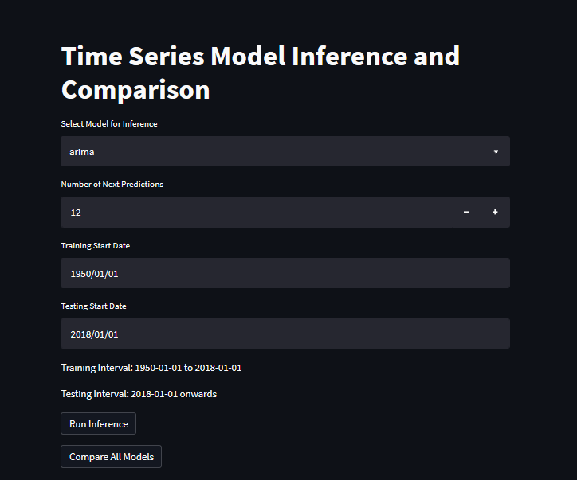
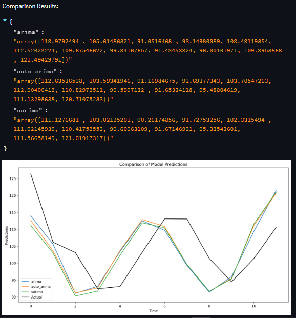

# SupplyzPro: Industrial Production Forecasting

## Project Overview

This project provides a flexible time series forecasting solution for analyzing industrial production of electric and gas utilities in the United States from 1939 to 2024.

## Interactive Streamlit Demo Features

The `demo.py` provides a highly interactive interface with capabilities to:
- Select from 3 different forecasting models (ARIMA, Auto ARIMA, SARIMA)
- Dynamically adjust number of prediction periods (1-100)
- Run individual model inference
- Compare predictions across all implemented models
- Visualize model predictions with actual data

Here are screenshots showcasing the Streamlit demo's features:


*Model selection and forecast period adjustment*



*Visualizing model predictions alongside actual data*


## Prerequisites

### Python Version
- **Recommended Python Version:** 3.6.13
- **Environment Setup:** Miniconda recommended

### Installation Steps

1. Clone the repository
2. Create virtual environment:
   ```bash
   conda create -n supplyzpro python=3.6.13
   conda activate supplyzpro
   ```

3. Install dependencies:
   ```bash
   pip install -r requirements.txt
   ```

## Project Structure

```
project_root/
│
├── data/                # Raw data
│── models/              # Trained model artifacts
│── src/                 # Core project 
│── visualizations/      # Generated plots and diagnostics
│
├── EDA.ipynb            # Exploratory Data Analysis
├── main.py              # Benchmarking script
├── demo.py              # Interactive Streamlit application
└── requirements.txt
```

## Usage

### Benchmarking
```bash
python main.py
```

### Interactive Demo
```bash
streamlit run demo.py
```

## Model Capabilities
- ARIMA: Traditional time series forecasting
- Auto ARIMA: Automated parameter selection for ARIMA
- SARIMA: Seasonal ARIMA for handling seasonality

## Evaluation Metrics
- Mean Absolute Percentage Error (MAPE)
- Mean Absolute Error (MAE)
- Root Mean Square Error (RMSE)

## Key Features
- Flexible model selection
- Interactive prediction interface
- Comprehensive model comparison
- Detailed visualization
